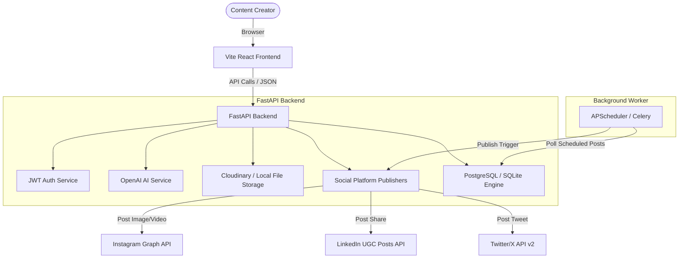

# SocialFlow AI - Social Media Scheduler Platform

SocialFlow AI is a production-ready, AI-powered social media management and scheduling SaaS platform. It allows users to draft, optimize, and schedule content across multiple platforms (Instagram, LinkedIn, Twitter/X) using an automated AI copy engine.

---

## 📐 Architecture Diagram



---

## 🛠 Tech Stack

### Frontend Client
* **Framework:** React 19 + Vite 8 (TypeScript)
* **Styling:** Tailwind CSS v4
* **Icons:** Lucide React

### Backend Server
* **Framework:** Python FastAPI
* **ORM:** SQLAlchemy (supports PostgreSQL & local SQLite fallback)
* **AI engine:** OpenAI API Client (GPT-4o-mini with Vision support)
* **Media hosting:** Cloudinary API SDK (fallback to local static uploads)
* **Scheduler:** APScheduler (integrated background thread) / Celery configurations

---

## 📦 Features

1. **AI Content Generator:** Analyze text prompts and vision uploads (images) to generate optimized, platform-tailored copy (Instagram, LinkedIn, Twitter/X).
2. **Platform Tabs Preview:** Review and edit generated copies, hashtags, story ideas, and summaries.
3. **Automated Scheduler:** Select a specific posting datetime and let the background worker automatically publish posts on-time.
4. **Central Analytics Dashboard:** Monitor views, likes, comments, and engagement rates across all linked profiles.
5. **Interactive Calendar:** Visual montly post logs with drag/click reschedule options.

---

## ⚙️ Environment Variables (`.env`)

Create a `.env` file in the `backend/` folder:

```ini
# JWT configuration
SECRET_KEY=super_secret_social_flow_ai_key_change_me
ALGORITHM=HS256
ACCESS_TOKEN_EXPIRE_MINUTES=60

# Database
DATABASE_URL=sqlite:///./social_flow.db # Falls back to SQLite automatically

# OpenAI
OPENAI_API_KEY=your_openai_api_key_here

# Cloudinary
CLOUDINARY_URL=cloudinary://your_cloudinary_url_here

# Social Media OAuth (Instagram, LinkedIn, Twitter)
INSTAGRAM_CLIENT_ID=your_id
INSTAGRAM_CLIENT_SECRET=your_secret
LINKEDIN_CLIENT_ID=your_id
LINKEDIN_CLIENT_SECRET=your_secret
TWITTER_CLIENT_ID=your_id
TWITTER_CLIENT_SECRET=your_secret

# SMTP Notifications
SMTP_HOST=smtp.gmail.com
SMTP_PORT=587
SMTP_USERNAME=notifications@example.com
SMTP_PASSWORD=smtp_password
```

---

## 🚀 Installation & Local Run

### Method 1: Local Manual Setup (Developer-Friendly)

#### 1. Start Backend FastAPI
```bash
# Navigate to backend
cd backend

# Create virtual environment
python3 -m venv .venv
source .venv/bin/activate

# Install dependencies
pip install -r requirements.txt

# Start local server
uvicorn app.main:app --reload
```
*The FastAPI server will run on [http://localhost:8000](http://localhost:8000).*

#### 2. Start Frontend Client
```bash
# Navigate to client
cd client

# Install dependencies
npm install

# Start Vite dev server
npm run dev
```
*The Vite dashboard will run on [http://localhost:5173](http://localhost:5173).*

---

### Method 2: Docker Compose (Production Environment)

To run the entire stack including a dedicated PostgreSQL database and Redis broker:
```bash
docker-compose up --build
```
* FastAPI: [http://localhost:8000](http://localhost:8000)
* PostgreSQL: `localhost:5432`

---

## 🚢 Deployment Guide

### Backend: Railway / Render
1. Connect your GitHub repository.
2. Link the environment variables (`DATABASE_URL`, `OPENAI_API_KEY`, etc.).
3. Set start command to `uvicorn app.main:app --host 0.0.0.0 --port $PORT`.

### Database: PostgreSQL Neon
1. Create a free Serverless Postgres on Neon.tech.
2. Copy the Connection String and set it as the `DATABASE_URL` env variable in your backend deployment.

### Frontend: Vercel / Netlify
1. Point build settings to:
   * Build Command: `npm run build`
   * Output Directory: `dist`
2. Set up backend CORS permissions inside backend `ALLOWED_ORIGINS` to allow your Vercel URL.
